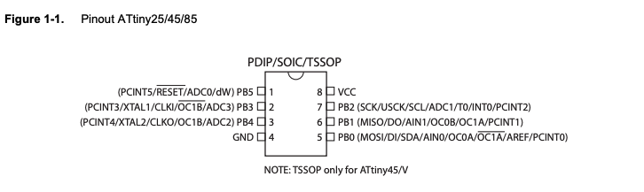
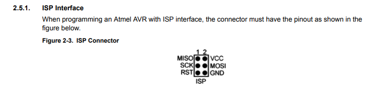

# tiny_satellite
This project is very much inspired from: https://www.bhoite.com/sculptures/satellite-2202/

---
### Programming:
Arduino IDE with this board: http://drazzy.com/package_drazzy.com_index.json 

AVR ISP Interface:

Connect Miso to Miso and Mosi to Mosi, etc… than you can programm

go to sketch > upload using programmer eventough you cannot find the AVR ISP MKII under  >>ls /dev/tty*

